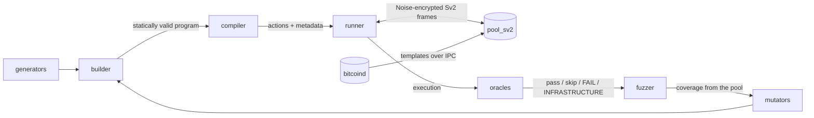
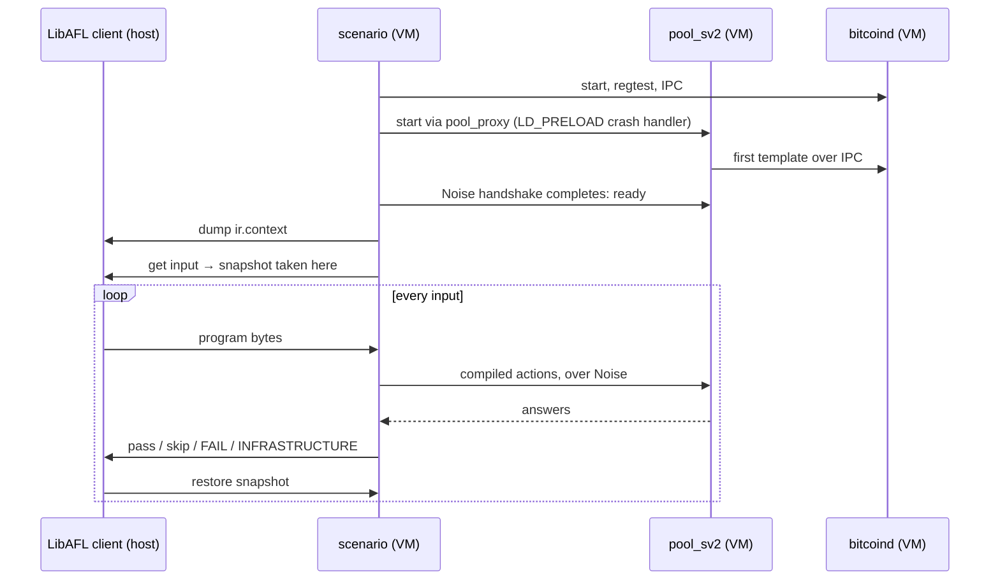
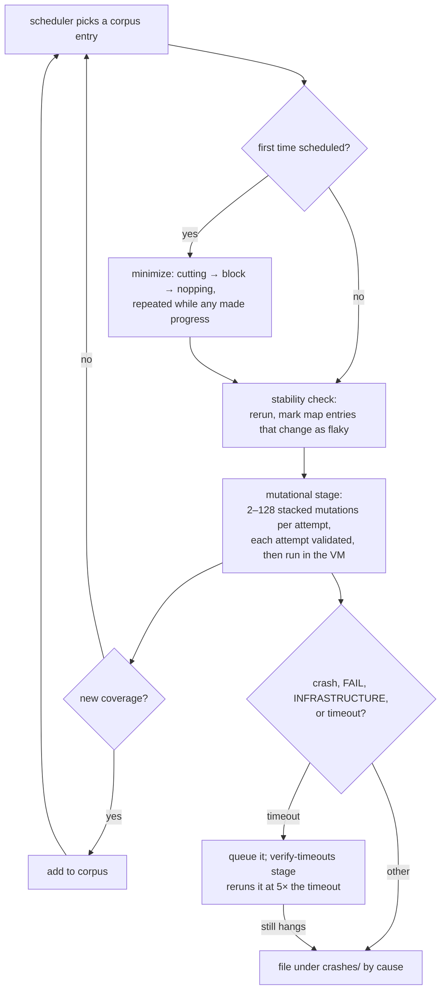

# How stratamoto works

This document explains how stratamoto works, from what a test case is to how a campaign finds
and files a bug. It follows the order a test case takes: written as a program, lowered to
actions, run against a real role, judged, and then mutated and minimized by the fuzzer.

stratamoto fuzzes [Stratum V2](https://github.com/stratum-mining/sv2-spec) roles. Today it
targets one: the pool from [sv2-apps](https://github.com/stratum-mining/sv2-apps), fed with
templates by a real Bitcoin Core node. It targets one message flow: `SetupConnection`, the
first thing any Sv2 client says. It borrows from two projects:

- [Fuzzilli](https://github.com/googleprojectzero/fuzzilli): test cases are programs in a
  typed intermediate language, mutated so that they stay valid. See its
  [HowFuzzilliWorks](https://github.com/googleprojectzero/fuzzilli/blob/main/Docs/HowFuzzilliWorks.md),
  which this document is modelled on.
- [fuzzamoto](https://github.com/dergoegge/fuzzamoto): the target runs inside a
  [Nyx](https://nyx-fuzz.com) snapshotting VM, driven by [LibAFL](https://github.com/AFLplusplus/LibAFL),
  with coverage from AFL instrumentation. stratamoto's fuzzer is a port of fuzzamoto-libafl.

The overall shape, before any of the details:



## Contents

1. [Goals](#goals)
2. [The IR](#the-ir)
3. [Compiling a program](#compiling-a-program)
4. [Running a program](#running-a-program)
5. [Judging a run: the oracles](#judging-a-run-the-oracles)
6. [Generating programs](#generating-programs)
7. [Mutating programs](#mutating-programs)
8. [Minimizing programs](#minimizing-programs)
9. [The fuzzer](#the-fuzzer)
10. [A note on determinism](#a-note-on-determinism)
11. [An example: the teardown livelock](#an-example-the-teardown-livelock)
12. [Limitations](#limitations)
13. [Where things are](#where-things-are)

## Goals

A network protocol role is a harder target than a parser. Four things have to hold for a
fuzzer to reach the code worth fuzzing.

**The bytes have to arrive.** Sv2 connections between real roles are Noise encrypted. A byte
string thrown at the pool's port never gets past the handshake, and one that does still has to
be a well-formed frame before the pool looks at the message inside. stratamoto's harness runs the
handshake and lays out frames itself, so the fuzzer only decides what goes inside them.

**The messages have to make sense in order.** Much of a role's logic sits behind earlier
messages. Nothing of the mining protocol means anything on a connection that was never set up,
and a connection is set up only once the server has answered `SetupConnection` with
`SetupConnection.Success`. A mutator that knows nothing about this spends its time on
connections that go nowhere. This is the same problem Fuzzilli calls semantic correctness: a
test case that fails at its first step says nothing about any later one.

**What a conforming client would not do still has to be reachable.** A fuzzer that only sends
valid sequences never reaches a role's error paths. stratamoto sends invalid ones on purpose,
labels them as the client's fault, and relaxes what it expects of the server in answer.

**Failures have to be more than crashes.** A pool that answers `SetupConnection` with a version
the client never proposed has not crashed, but it has broken the specification. stratamoto
judges every run against what the specification requires of any implementation, and files
the result by the rule that was broken.

The rest of this document is how each of these is met.

## The IR

A test case is a program, not a byte string. A program is a list of instructions, each an
operation applied to earlier variables:

```
// roles=1 connections=0 seed=7
v0 <- LoadRole(0)
v1 <- Connect(v0)
v2 <- LoadVersion(2)
v3 <- LoadVersion(2)
v4 <- LoadFlags(0x00000005)
BeginBuildSetupConnection -> v5
  SetVersions(v5, v2, v3)
  SetFlags(v5, v4)
  v6 <- LoadStr("stratamoto")
  v7 <- LoadStr("")
  v8 <- LoadStr("")
  v9 <- LoadStr("")
  SetDeviceInfo(v5, v6, v7, v8, v9)
v10 <- EndBuildSetupConnection<mining>(v5)
v11 <- SendSetupConnection<mining>(v1, v10)
```

This is `stratamoto generate 7 1 | stratamoto print`. Read it as: take role 0, open a
connection to it, build a `SetupConnection` with version range 2..=2 and flags `0b101`, set its
device fields, finalize it for the mining protocol, and send it on the connection.

`vN <-` names what an instruction produces, and the parenthesised arguments are the variables it
consumes. `-> vN` after a block beginning names what that block makes available inside itself.
Indentation is a scope: `v5`, the message under construction, exists only between
`BeginBuildSetupConnection` and `EndBuildSetupConnection`.

The header line is the program's context
([`ProgramContext`](../crates/stratamoto-ir/src/lib.rs)): how many roles the deployment has,
how many connections exist before the program runs, and a seed. A program can only address what
its context says exists.

### Variables are types

In [`variable.rs`](../crates/stratamoto-ir/src/variable.rs), a `Variable` is a type, not a
value. Each operation declares the types it consumes and produces
([`operation.rs`](../crates/stratamoto-ir/src/operation.rs)), and the types are where the
protocol's structure lives:

| type | what it is | produced by | consumed by |
| --- | --- | --- | --- |
| `role` | an index into the deployment | `LoadRole` | `Connect` |
| `connection` | a transport to a role, before any Sv2 message | `Connect`, `LoadConnection` | `SendSetupConnection`, `SendRawFrame` |
| `mut-setup-connection` | a `SetupConnection` under construction | `BeginBuildSetupConnection` (inside its block) | `Set*`, `EndBuildSetupConnection` |
| `setup-connection<p>` | a finalized `SetupConnection` for subprotocol `p` | `EndBuildSetupConnection<p>` | `SendSetupConnection<p>` |
| `setup-attempt<p>` | a setup that was sent; the server has not answered yet | `SendSetupConnection<p>` | `BeginOnSetupSuccess<p>` |
| `session<p>` | a connection the server agreed to set up for `p` | `BeginOnSetupSuccess<p>` (inside its block) | subprotocol messages, once there are any |
| `version`, `flags`, `port`, `str`, `bytes`, `duration` | plain data | `Load*` | the operations that take them |

Two of these rules carry most of the weight:

- **A message is tied to a subprotocol.** `setup-connection<mining>` and
  `setup-connection<template-distribution>` are different types, so a message finalized for
  one cannot be sent as the other.
- **Sending a setup does not create a session.** `SendSetupConnection` yields only an attempt. The
  session exists inside `BeginOnSetupSuccess`, a block that runs only if the server answered
  with `SetupConnection.Success`. Anything that needs a session can therefore only be written
  where the server has agreed to one:

```
v0 <- LoadRole(0)
v1 <- Connect(v0)
BeginBuildSetupConnection -> v2
v3 <- EndBuildSetupConnection<mining>(v2)
v4 <- SendSetupConnection<mining>(v1, v3)
BeginOnSetupSuccess<mining>(v4) -> v5
  v6 <- LoadBytes(3 bytes)
  SendRawFrame(0x1b, 0x0000)(v1, v6)
EndOnSetupSuccess
```

`v5` is a `session<mining>`, in scope only between the block's delimiters. A message left
unset keeps the value a client would send: here the `SetupConnection` has no `Set*`
instructions, so it goes out with version 2..=2 and flags 0.

### The builder

Programs are built through the
[`ProgramBuilder`](../crates/stratamoto-ir/src/builder.rs), which tracks the variables and
scopes and rejects any instruction whose inputs are out of scope or of the wrong type:

```rust
let role = builder.append_op(Operation::LoadRole(0), &[])?.remove(0);
let connection = builder.append_op(Operation::Connect, &[&role])?.remove(0);
// ...
builder.append_op(Operation::BeginOnSetupSuccess { protocol: Protocol::JobDeclaration }, &[&attempt])
// Err(InvalidVariableType { is: SetupAttempt(Mining), expected: SetupAttempt(JobDeclaration) })
```

Using `mut-setup-connection` after `EndBuildSetupConnection` fails with `VariableNotDefined`,
since its scope has closed. A `LoadRole` beyond the context's role count fails with
`RoleNotFound`. A block left open fails in `finalize`. Anything that leaves `finalize` is
*statically valid*.

`Program::is_statically_valid` re-checks a program built some other way, by replaying it through
a fresh builder. `ProgramBuilder::from_prefix` does the same for the first *n* instructions and
leaves open scopes open. That is how a mutator asks what is in scope at the point it is
rewriting.

### Invalid for the protocol, valid in the IR

Static validity is about the IR, not the protocol. A second `SetupConnection` on a connection,
or one sent after a frame of the program's own choosing, type-checks fine: both are things a
client can do, and a server has to cope with them. The IR allows them. The
[compiler](#compiling-a-program) labels them as the client's violation, so that an oracle does
not hold the server to an answer it no longer owes.

### Properties of the IR

1. **Single assignment.** Every instruction defines fresh variables, numbered in order. Inputs
   are indices into the variables defined before the instruction.
2. **Typed.** Every variable has a type, and every operation declares the types it consumes and
   produces. The builder checks them.
3. **Scoped.** Blocks open scopes. Variables defined in a block, including the block's own
   inner outputs, are visible only inside it.
4. **Valid by construction.** A program that leaves the builder is statically valid, and
   validity can be re-checked cheaply at any time.
5. **Nop-able.** Any instruction other than a block delimiter can be replaced by a `Nop` that
   defines the same number of variables. Later indices stay valid, which is what minimization
   relies on.
6. **Implementation-agnostic and serializable.** The IR never holds wire types. A program
   serializes with `postcard`, and that encoding is the corpus format: a corpus entry or a
   finding is a file that a scenario binary replays and `stratamoto print` shows.

## Compiling a program

The [compiler](../crates/stratamoto-ir/src/compiler.rs) lowers a program to a flat list of
`Action`s: `Connect`, `Send` (one frame), `AwaitSetupResponse`, `EnterOnSetupSuccess`,
`ExitBlock`, `AdvanceTime` and `Probe`. It walks the instructions once and keeps one value per
variable. Building a `SetupConnection` edits a `SetupConnectionSpec` that starts at what a
client would send. Finalizing it stamps the protocol. Sending it encodes the message with the
protocol crates, at the sv2-apps revision the pool under test is built from, so both sides agree
on the wire format.

`stratamoto compile` shows the result. Each action carries, in brackets, the index of the
instruction it came from:

```
[1] Connect { connection: 0, role: 0 }
[14] Send { connection: 0, extension_type: 0, message_type: 0, channel_msg: false, payload: [0, 2, 0, 2, 0, 5, 0, 0, 0, 7, 48, 46, 48, 46, 48, 46, 48, 0, 0, 10, 115, 116, 114, 97, 116, 97, 109, 111, 116, 111, 0, 0, 0] }
[14] AwaitSetupResponse { connection: 0, session: 0, protocol: Mining, first_on_connection: true }
```

Most instructions lower to no action: `Load*` and `Set*` only change the compiler's values.
One instruction, `SendSetupConnection`, lowers to two actions: the send and the wait for its
answer.

Alongside the actions the compiler writes `CompiledMetadata`: which instruction each action came
from, which variable defines each connection and session, the `SetupConnectionSpec` behind each
session, and the client's violations. That metadata is how a failure is reported against the
line of the program responsible for it.

### Classifying the client's violations

The compiler tracks which connections something has been sent on, and which have carried a raw
frame. When a `SetupConnection` goes out it records whether it was the first message on its
connection, and notes on the `AwaitSetupResponse` action any `ClientViolation`s:

- `SetupNotFirst`: something was sent on the connection before this setup.
- `RawFrameBefore`: a frame of the program's own choosing preceded it.

```
v0 <- LoadRole(0)
v1 <- Connect(v0)
v2 <- LoadBytes(6 bytes)
SendRawFrame(0x32, 0x0000)(v1, v2)
...
v10 <- SendSetupConnection<mining>(v1, v9)

a0 [i1] Connect { connection: 0, role: 0 }
a1 [i3] Send { connection: 0, extension_type: 0, message_type: 50, ... }
a2 [i14] Send { connection: 0, extension_type: 0, message_type: 0, ... }
a3 [i14] AwaitSetupResponse { connection: 0, session: 0, protocol: Mining, first_on_connection: false }
violations: {3: [SetupNotFirst, RawFrameBefore]}
```

The oracle reads this classification off the metadata instead of working it out again.

A success block lowers to an `EnterOnSetupSuccess` that knows the index of its matching
`ExitBlock`. The runner can then skip the whole block in one step when the setup was
rejected.

## Running a program

The harness lives in the [`stratamoto`](../crates/stratamoto) crate. It runs a compiled program
against a `Deployment` and records what happened.

### Deployments and transports

[`transport.rs`](../crates/stratamoto/src/transport.rs) defines two traits:

- `Transport` sends a frame and receives one with a timeout. It is synchronous: a real role runs
  on its own runtime behind a real socket, and the harness has nothing to do while it waits.
- `Deployment` is what a program addresses. It opens a connection to a role by index, reports
  what each role serves (`RoleConfig`: protocol, version range, supported flags), lets time
  pass, and answers `is_alive`: whether a fresh connection can still be opened.

The only deployment today is
[`PoolDeployment`](../crates/stratamoto-targets/src/pool.rs). It starts Bitcoin Core in regtest
with IPC enabled, using sv2-apps' own launcher. It then starts the pool binary as its own
process, with a configuration that points it at the node's data directory. The pool takes
templates over the node's IPC socket, with nothing in between. Startup waits until a full Noise
handshake completes, not just a TCP connect, because the pool binds its port before its first
template arrives but only accepts connections afterwards.

Every connection is a [`NoiseTransport`](../crates/stratamoto/src/noise.rs): a TCP socket on
which the harness runs the handshake as initiator, as a downstream would, and then encrypts and
frames every message.

### One dispatcher per connection

An Sv2 connection carries answers to requests and unprompted notifications on the same ordered
stream. Reading "the next frame" after a request mistakes one for the other as soon as a server
sends anything unprompted. So every frame goes through one
[dispatcher](../crates/stratamoto/src/events.rs): it validates the header, decodes the payload
once, classifies it as an `Event` and updates the connection's `SetupState`:

```
Unsent → Pending → Established { used_version, flags }
                 → Rejected { flags, error_code }
                 → Unexpected { message_type }   (the first frame after the setup was not an answer)
```

A frame on an extension the harness does not speak is `Unknown`. A known message type whose
payload does not decode is `Malformed`. A message the harness decodes but does not model
(anything from a subprotocol) is `Other`. A channel bit that disagrees with the message is kept
as a `HeaderIssue`. Everything is kept in order in the connection's trace.

### The runner

[`runner::run`](../crates/stratamoto/src/runner.rs) carries out the actions in order and records
**exactly one `ActionOutcome` per action**: `Completed` (with what was awaited, if anything),
`TimedOut`, `TransportClosed`, `TransportError`, `Skipped` (with the unmet prerequisite), or
`HarnessError`. Oracles walk the program and look up each action's outcome. They never walk only
what happened, which would let missing work pass unnoticed.

- `AwaitSetupResponse` pumps the connection through the dispatcher until the setup state leaves
  `Pending`. It waits up to 10 seconds for an answer the server owes (the first setup on a
  connection) and 100 milliseconds for one it does not. A role may stay silent after a second
  setup, and waiting the full timeout every time would make runs against a real role mostly
  waiting.
- `EnterOnSetupSuccess` checks whether the session's setup got `Success`. If not, every action up
  to and including the block's exit is recorded as `Skipped(SetupSuccess(session))`, so the
  trace says why nothing in there happened.
- `Probe` drains whatever each connection has received without waiting.

At `RUST_LOG=debug` the runner traces each action with its instruction, outcome and duration.
This is how a replayed finding is read.

## Judging a run: the oracles

An [oracle](../crates/stratamoto/src/oracle.rs) checks an execution against a property the
protocol requires of any implementation. A scenario runs them in a fixed order and reports the
first failure:

1. **`HarnessIntegrityOracle`**: the execution has an outcome for every action, and none is a
   `HarnessError`. A failure here is about the harness, not the pool, so it is reported as
   `INFRASTRUCTURE` and never as a finding. It runs first because the other oracles assume what it
   checks.
2. **`SetupConnectionOracle`**: every `SetupConnection` the server owed an answer to got one the
   specification allows.
3. **`CrashOracle`**: the deployment is still serving after the run. A conforming role stays up
   whatever one client sends it. A pool that crashed, or shut itself down, fails this.

### What the specification requires, and nothing more

`SetupConnectionOracle` checks the specification, not what one implementation happens to do.
Being stricter than the specification produces failures against correct roles, and those drown
out the real ones. For each `AwaitSetupResponse`:

- An answer is **owed** only if the setup was the first message on its connection and the
  compiler noted no violation on it. If it was not owed, anything the server does is fine.
- If it was owed: silence, a closed connection, or a frame that is neither `Success` nor
  `Error` is a failure ("the server MUST respond with SetupConnection.Success or
  SetupConnection.Error").
- Any `SetupConnection.Error` is acceptable. Error codes are recorded but not compared, since
  section 3.5 leaves them to each implementation.
- A `Success` must choose a `used_version` inside the range the client proposed. For mining, it
  must not set `REQUIRES_FIXED_VERSION` when the client set `REQUIRES_VERSION_ROLLING`.
- Then what the deployment says about the role: a role that accepts a subprotocol it does not
  serve, or settles on a version it does not support, has agreed to something it cannot do.

Accepting flags the server does not act on is not a failure. The specification allows it.

### Verdicts

A scenario's result is one of `Ok`, `Skip` (the input does not describe a runnable test case,
e.g. it does not decode, or addresses more roles than the deployment has), `Fail`, or
`Infrastructure`. A failure's message starts with `FAIL: ` and the oracle's name, and an
infrastructure verdict starts with `INFRASTRUCTURE: `. Locally the exit code is 0, 1 or 2. Under
the fuzzer, the message is how a finding is [filed](#findings).

## Generating programs

A [generator](../crates/stratamoto-ir/src/generators) appends a self-contained fragment to a
program through the builder, so what it produces is valid by construction. There are three.

**`SetupConnectionGenerator`**: what a conforming client does. It opens a connection (fresh, by
default: only the first setup on a connection is owed an answer, so fresh connections reach the
deepest states), picks a subprotocol, and sends a `SetupConnection` with version 2..=2 and a
random subset of the flags that subprotocol defines. Half the time it also sets the endpoint
fields, and half the time the device fields. That way both shapes end up in the corpus, since
[a field no instruction writes is a field no mutation can reach](#reachability).

**`AdversarialSetupGenerator`**: one thing a conforming client does not do, done on purpose,
with everything else as a conforming client would send it:

| violation | what it sends | reaches |
| --- | --- | --- |
| `EmptyVersionRange` | `min_version` above `max_version` | the server's rejection path |
| `UnknownVersion` | a range without version 2: 0, 1, 3 or 65535 | the server's rejection path |
| `UndefinedFlags` | at least one flag bit the subprotocol does not define | the server's rejection path |
| `AfterRawFrame` | a raw frame, then the setup | ordering: the setup is not first |
| `SecondSetup` | two setups on one connection | ordering: the second is not owed an answer |

**`RawFrameGenerator`**: the way out of well-formed messages. Up to 63 random bytes as the
payload of a frame with a random message type, on an existing connection when the program has
one. A quarter of the time it uses a random nonzero extension type, so a role's handling of an
unknown extension is reached too. This is how the pool's decoder sees bytes no message type
would produce.

`stratamoto generate` runs only the conforming generator. In the fuzzer, all three are wrapped
so that each draws a random role from the deployment.

## Mutating programs

A [mutator](../crates/stratamoto-ir/src/mutators) rewrites a program in place. Unlike a
generator it may leave the program invalid, so every caller re-validates and discards a failed
attempt. In the fuzzer that check is `acceptable`: statically valid and at most 4096
instructions. Starting from this program:

```
v0 <- LoadRole(0)
v1 <- Connect(v0)
v2 <- LoadVersion(2)
v3 <- LoadVersion(2)
v4 <- LoadFlags(0x00000007)
BeginBuildSetupConnection -> v5
  SetVersions(v5, v2, v3)
  SetFlags(v5, v4)
v6 <- EndBuildSetupConnection<mining>(v5)
v7 <- SendSetupConnection<mining>(v1, v6)
```

### OperationMutator

Rewrites the data an operation carries and leaves the shape of the program alone. It picks
instructions in random order until one admits a rewrite. Here, `LoadVersion(2)` becomes
`LoadVersion(34)`, and the setup now proposes 2..=34:

```
v3 <- LoadVersion(34)
```

Each rewrite is one of three kinds: a boundary value for the field, the current value with one
bit flipped, or a random value. It never keeps the current value. The boundary values are
chosen per field:

| field | boundary values |
| --- | --- |
| version | 0, 1, 2, 3, 65534, 65535 |
| flags | 0, 1, 2, 4, `0b111`, `0b1000`, `0x80000000`, `0xffffffff` |
| port | 0, 1, 1023, 1024, 65534, 65535 |
| raw frame message type | 0x00–0x04, 0x10, 0x7f, 0xff |
| raw frame extension type | 0, 1, 0x7fff, 0x8000, 0xffff |
| string | empty, 255 bytes, 256 bytes (one over `STR0_255`), or one more character |
| bytes | one bit flipped, one byte added, or one removed |

Flipping one bit keeps a mutation close to where it started, which is what gets from a
supported flag to an unsupported one. `LoadRole` and `LoadConnection` are only rewritten to
another index the context has, since the builder rejects any other.

The protocol in `EndBuildSetupConnection<p>`, `SendSetupConnection<p>` and
`BeginOnSetupSuccess<p>` is deliberately not rewritten. The three have to agree for the program
to type-check, so rewriting one alone always produces a program the builder rejects. The match
in `mutate_operation` is exhaustive on purpose: an operation added without deciding whether it
is mutable does not compile.

### InputMutator

Rewires one input of one instruction to a different in-scope variable of the same type. After
concatenating the program with a copy of itself, it has two `flags` variables in scope. Rewiring
the second `SetFlags` to use the first one gives:

```
BeginBuildSetupConnection -> v13
  SetVersions(v13, v10, v11)
  SetFlags(v13, v4)
```

Because the replacement must have the same type and be in scope, InputMutator explores how a
message behaves when it refers to a different earlier value. It never produces a program that
could not have been written by hand. It can move a send to another connection, or a setup onto
a connection that already has one.

### ConcatMutator

Appends another program's instructions, shifting their inputs past the variables already
defined. This is how a program grows past what one generator produces: two setups on one
deployment, or a setup followed by whatever another program did. In the fuzzer it is a
splicer. It appends a different corpus entry, and only one that has already been minimized.

### Generator insertion

Mutating values can never add an operation the program does not already have, so growth has to
come from generators. In the fuzzer,
[`IrGenerator`](../crates/stratamoto-libafl/src/mutators.rs) inserts a generated fragment at a
random point outside any block, not just at the end. It rebuilds the prefix up to that point,
lets the generator append, then shifts the inputs of the remaining instructions by the number of
variables the fragment defined. Appending a raw frame to the program above gives:

```
v7 <- SendSetupConnection<mining>(v1, v6)
v8 <- LoadBytes(48 bytes)
SendRawFrame(0xa0, 0x0000)(v1, v8)
```

### Weights

The fuzzer schedules mutations with LibAFL's `TuneableScheduledMutator`, with these relative
weights:

| mutation | weight | share |
| --- | --- | --- |
| `InputMutator` | 2000 | 56% |
| `OperationMutator` | 1000 | 28% |
| `SetupConnectionGenerator` | 200 | 5.6% |
| `AdversarialSetupGenerator` | 200 | 5.6% |
| `ConcatMutator` | 100 | 2.8% |
| `RawFrameGenerator` | 100 | 2.8% |

Each mutational round stacks between 2 and 128 mutation attempts on one input, most often 8
(40%) or 16 (30%). `--mutators a,b` enables only the named ones. `--swarm p` enables each one with
probability *p*, per client, for swarm testing. Each client writes the weights it ended up with to
`config.json` in its output directory.

## Minimizing programs

A program that reaches new coverage is minimized before it is mutated. Otherwise every
descendant inherits its dead weight. A [minimizer](../crates/stratamoto-ir/src/minimizers)
proposes smaller programs one at a time and is told whether each still reproduces what matters.
There are three passes, run in this order:

- **Cutting**: removes a run of instructions from the end, halving the run each time a cut is
  rejected. This takes a long program down quickly.
- **Block**: removes a whole block, from its beginning to its matching end. Nopping cannot do
  this: delimiters are not noppable, and removing either one alone leaves the scopes unbalanced.
- **Nopping**: replaces one instruction at a time with a `Nop` that defines as many variables as
  it did, so every later index stays valid. Nops are dropped once minimization finishes.

Each pass runs forward once, so an instruction can only go after whatever used it has already
gone. Minimizing the raw frame program above, keeping only the raw frame, shows why one pass is
not enough. Nopping removes the `Set*`s and the send, but the loads and the block they used come
earlier and survive:

```
v0 <- LoadRole(0)
v1 <- Connect(v0)
v2 <- LoadVersion(2)
v3 <- LoadVersion(2)
v4 <- LoadFlags(0x00000007)
BeginBuildSetupConnection -> v5
v6 <- EndBuildSetupConnection<mining>(v5)
v7 <- LoadBytes(48 bytes)
SendRawFrame(0xa0, 0x0000)(v1, v7)
```

So the fuzzer repeats the three passes while any of them made progress. The next round's block
pass takes out the now-empty block, and its nopping pass the dead loads, leaving
`LoadRole`, `Connect`, `LoadBytes` and `SendRawFrame`.

What "still reproduces" means depends on why the program is being minimized. A corpus entry must
still hit every coverage-map index it was kept for: its novelties, as LibAFL tracks them. A
finding being minimized with `-m <file>` must still end in something other than a pass. A pass
gives up after 200 consecutive rejected candidates.

## The fuzzer

The fuzzer, [`stratamoto-libafl`](../crates/stratamoto-libafl), follows fuzzamoto's design: a
scenario binary brings the target up inside a Nyx VM and takes a snapshot, and every input runs
from that snapshot.

### Scenarios

A [scenario](../crates/stratamoto/src/scenario.rs) pairs a deployment with the oracles that judge
it. `Scenario::new` brings up what every test case shares. `Scenario::run` runs one test case.
`stratamoto_main!` turns a scenario into a binary. Its runner decides where input comes from and
where verdicts go:

- Built normally, it reads a program from `STRATAMOTO_INPUT` or stdin and reports through its
  exit code. This is how findings are replayed by hand.
- Built with `--features nyx`, it talks to the Nyx agent
  ([`stratamoto-nyx-sys`](../crates/stratamoto-nyx-sys), vendored from fuzzamoto). The first
  request for input takes the VM snapshot. A finding is printed and reported by hypercall. A skip
  and a pass restore the snapshot.

The one scenario today is
[`pool_setup_connection`](../crates/stratamoto-scenarios/src/pool_setup_connection.rs). It starts
the node and the pool, then dumps its `ProgramContext` (one role) to the host as `ir.context`, so
that the fuzzer generates programs for the roles that actually exist. For each input it decodes
the program, checks it is statically valid, compiles it, runs it and evaluates the oracles.

### Inside the VM

`stratamoto init` builds the Nyx share directory. It contains the scenario, the pool, the crash
handler, every shared library any of them or the node's binaries load, an archive of Bitcoin
Core, the VM's configuration, and a boot script. At boot the VM fetches it all into `/tmp`,
brings the loopback interface up, and starts the scenario with the pool behind a small proxy
script that preloads the crash handler into it:



Coverage comes from the pool alone. It is built with
[cargo-afl](https://github.com/rust-fuzz/afl.rs), and the Nyx agent hands it a shared coverage
map whose size is fixed when the agent is built. That is why `STRATAMOTO_POOL` must name the
instrumented pool at build time: the build runs it with `AFL_DUMP_MAP_SIZE=1` to learn the size.
The node and the harness are not instrumented. An uninstrumented pool runs too, with no coverage
to guide the fuzzer.

### A client

The fuzzer launches one LibAFL client per core (`--cores`). The clients exchange new corpus
entries through a broker. Each client drives its own VM and has its own corpus under
`<output>/cpu_NNN/queue` and its own findings under `<output>/cpu_NNN/crashes`. Its parts are:

- **Input**: `IrInput`, a program, handed to the VM as its postcard encoding. The scenario
  compiles it inside the VM, which keeps inputs small and the corpus readable. An input's length
  is its instruction count.
- **Seed**: if the input directory is empty, one empty program in the scenario's context.
  InputMutator, OperationMutator and ConcatMutator have nothing to work on in an empty program, so
  the corpus grows from the generators first.
- **Observers**: the pool's coverage map with hit counts, the execution time, and the VM's
  output stream, which is where findings are reported.
- **Feedback**: an input joins the corpus if it reaches coverage no earlier input reached.
- **Scheduler**: LibAFL's `IndexesLenTimeMinimizerScheduler` over a weighted scheduler with the
  `explore` power schedule. It favours the shortest, fastest entry that covers each part of the
  map.

Each time the scheduler picks a corpus entry, the client runs these stages on it:



### Findings

A run is a **finding** when the VM crashes, the scenario reports `FAIL` or `INFRASTRUCTURE`, or a
timeout survives confirmation. A finding is kept only if it also reaches coverage no earlier
finding reached, so a campaign does not file the same bug a thousand times.

A timeout is not filed straight away. It is queued, and a later stage reruns it with the timeout
multiplied by `--hang-multiple` (5 by default). It is filed only if it still hangs. `--ignore-hangs`
turns this off.

[`CrashCauseFeedback`](../crates/stratamoto-libafl/src/feedbacks.rs) names each finding after the
cause in the VM's output. `FAIL: SetupConnectionOracle: …` is filed as `setupconnection-<hash>`,
`FAIL: CrashOracle: …` as `crash-…`, `INFRASTRUCTURE: …` as `infrastructure-…`, and a confirmed
hang as `timeout-…`. Each file is a bare program:

```sh
stratamoto print < /tmp/out/cpu_000/crashes/setupconnection-0
STRATAMOTO_INPUT=/tmp/out/cpu_000/crashes/setupconnection-0 RUST_LOG=debug pool_setup_connection
stratamoto-libafl ... -r /tmp/out/cpu_000/crashes/setupconnection-0    # rerun in the VM
stratamoto-libafl ... -m /tmp/out/cpu_000/crashes/setupconnection-0    # minimize in the VM
```

## A note on determinism

Fuzzilli has to deal with engines that behave slightly differently from run to run. stratamoto
has more of that: the target is a real multi-threaded process, reached over real sockets, fed
by a real node. Three things keep that under control:

- **The snapshot.** Every input starts from the same VM state: the pool already up, its first
  template taken, no connection yet made. The pool remembers what earlier connections did. The
  snapshot is what stops one input from seeing what another left behind. Locally, one scenario
  process runs one program for the same reason.
- **The stability check.** Before an entry is mutated it is rerun. Coverage-map entries that
  change between identical runs are marked as flaky, and no longer count as new coverage.
- **Timeout confirmation.** A hang has to reproduce at five times the timeout before it is
  filed.

None of this makes a run a pure function of its program. A finding caused by a race may need
several replays to trigger. A deterministic runtime, with a seeded executor, clock, network and
filesystem, is being sketched in [`stratamoto-dst`](../crates/stratamoto-dst). That is what the
`seed` in `ProgramContext` is for. It is not wired into the harness or the fuzzer.

## An example: the teardown livelock

Here is a finding end to end. A program of this shape, a rejected setup followed by one more
frame on the same connection:

```
v0 <- LoadRole(0)
v1 <- Connect(v0)
v2 <- LoadVersion(3)
v3 <- LoadVersion(3)
v4 <- LoadFlags(0x00000001)
BeginBuildSetupConnection -> v5
  SetVersions(v5, v2, v3)
  SetFlags(v5, v4)
v6 <- EndBuildSetupConnection<mining>(v5)
v7 <- SendSetupConnection<mining>(v1, v6)
v8 <- LoadBytes(40 bytes)
SendRawFrame(0x2a, 0x0000)(v1, v8)
```

This is `AdversarialSetupGenerator` with `UnknownVersion`, then a `RawFrameGenerator` fragment
that reused the connection in scope. The pool answers the setup with `SetupConnection.Error`,
which the oracle accepts. It then deliberately sleeps one second before closing the connection,
so that the error reaches the client. The raw frame arrives inside that window and races the
teardown. On an unlucky interleaving, a pool worker spins at close to a full core. With one core
to run on, as inside the VM, the pegged worker starves the pool's runtime, and fresh connections
fail their handshake.

The oracle meant to catch this is `CrashOracle`: the pool is no longer serving. In a campaign,
though, it shows up as `timeout-*`. The harness waits up to 10 seconds for an owed answer and
for a liveness handshake, which is longer than the VM's confirmation rerun. The VM times out
before the oracle can say the pool stopped serving. Either way the program is in `crashes/`,
readable, and replays outside the fuzzer.

It is recorded as an ignored test,
[`a_second_frame_in_the_teardown_window_can_livelock_the_pool`](../crates/stratamoto-targets/tests/pool.rs).
The test asserts the bug is present, so it starts failing when sv2-apps fixes it. See the
[root README](../README.md#a-known-upstream-finding).

## Limitations

The scope is deliberately narrow: each part handles `SetupConnection` completely before the next
message is added. [`FEATURES.md`](../FEATURES.md) tracks each message through the IR, compiler,
runner, oracles and tests. In particular:

- **No subprotocol messages yet.** A connection can be set up for mining, job declaration or
  template distribution, and the success block is typed for that protocol, but no message of
  any subprotocol can be sent inside it except as raw bytes. What a server sends of them is
  decoded and kept in the trace as `Other`.
- **Some operations exist that no generator produces yet.** `BeginOnSetupSuccess`,
  `AdvanceTime`, `Probe` and `LoadConnection` are part of the IR, and the compiler, runner and
  minimizers handle them, but no generator writes them. A campaign therefore never produces a
  success block today. They are in place for when there are messages that need a session.
- **The protocol of a setup is never mutated.** Changing it means changing three instructions
  together. That would be a structural mutation, and there is none yet. A setup's protocol is
  whatever its generator picked.
- **One target.** The pool is the only deployment. `Deployment` is the interface a new target
  implements. The runner and every oracle then apply to it unchanged.
- **Coverage is the pool's alone.** The node is not instrumented, so how the pool's requests
  exercise it is not measured.
- **Nyx needs bare metal.** A campaign needs x86_64 Linux with KVM and KVM's VMware backdoor
  enabled. Everything except the campaign itself (generating, printing, compiling, running a
  scenario against a local pool) needs only a Rust toolchain, plus Bitcoin Core for anything that
  touches the pool.

### Reachability

A field no instruction writes is a field no mutation can reach: OperationMutator can only
rewrite values that some `Load*` put in the program. [`tests/coverage.rs`](../crates/stratamoto-ir/tests/coverage.rs)
runs a small campaign against the IR alone and fails if any field of `SetupConnection` stays at a
single value. It is what caught the endpoint and device fields never moving at all, and it is why
the conforming generator now sets them half the time.

## Where things are

| crate | what it holds |
| --- | --- |
| [`stratamoto-ir`](../crates/stratamoto-ir) | the IR: variables, operations, builder, compiler, generators, mutators, minimizers |
| [`stratamoto`](../crates/stratamoto) | the harness: Noise transport, dispatcher, runner, oracles, scenario entry point, runners |
| [`stratamoto-targets`](../crates/stratamoto-targets) | the real roles: sv2-apps' pool against Bitcoin Core over IPC |
| [`stratamoto-scenarios`](../crates/stratamoto-scenarios) | one binary per scenario: `pool_setup_connection` |
| [`stratamoto-nyx-sys`](../crates/stratamoto-nyx-sys) | the Nyx agent and crash handler, vendored from fuzzamoto |
| [`stratamoto-libafl`](../crates/stratamoto-libafl) | the fuzzer: LibAFL clients driving Nyx VMs |
| [`stratamoto-cli`](../crates/stratamoto-cli) | `generate`, `print`, `compile`, and `init` for the Nyx share directory |
| [`stratamoto-dst`](../crates/stratamoto-dst) | a deterministic runtime, in progress and not wired in |

How to build and run all of this is in the [README](../README.md).
